# Code Cleanup

[](https://github.com/TR-RBM/codecleaner/actions/workflows/ci.yml)
[](https://github.com/TR-RBM/codecleaner/releases/latest)
[](https://github.com/TR-RBM/codecleaner/releases)
[](UNLICENSE)

`codecleanup` replaces the comments in source files with short references
("refids") and moves the original text into a docs folder. `--restore`
puts the comments back.

```rust
fn main() {
    // So we're doing something complicated here, long enough that we need
    // multiple lines of comments to do it!
    let lucky_number = 7; // I'm feeling lucky today
}
```

becomes

```rust
fn main() {
    // refid: 1
    let lucky_number = 7; // refid: 2
}
```

and `docs/main.md` receives both comments under their refid.



## Install

Download the file for your system from the
[latest release](https://github.com/TR-RBM/codecleaner/releases/latest).

| System | File | Install |
|--------|------|---------|
| Debian, Ubuntu | `codecleanup_<version>-1_amd64.deb` | `sudo apt install ./codecleanup_*.deb` |
| Red Hat, Rocky, Fedora | `codecleanup-<version>-1.x86_64.rpm` | `sudo dnf install ./codecleanup-*.rpm` |
| Arch, Artix | `codecleanup-<version>-1-x86_64.pkg.tar.zst` | `sudo pacman -U codecleanup-*.pkg.tar.zst` |
| Windows | `codecleanup-v<version>-x86_64-windows.msi` | double-click |
| Any Linux | `codecleanup-v<version>-x86_64-linux.tar.gz` | unpack, copy `codecleanup` into your `PATH` |

The `.deb`, `.rpm` and `.tar.gz` files exist for `aarch64`/`arm64` as
well. They contain a static binary without dependencies, so they work on
old and new releases alike. The Linux packages install the bash and fish
completions too.

On Arch-based systems the package can also be built from
`packaging/arch/PKGBUILD` with `makepkg -si`.

The Windows installer needs no administrator rights. It installs for the
current user into `%LOCALAPPDATA%\Programs\codecleanup`, adds that folder
to the user's `PATH` and lists the program under "Installed apps", where
it can be removed again. Open a new terminal after installing.

## Usage

```sh
codecleanup --in=src/ --docs=docs/            # comments -> refids
codecleanup --in=src/ --docs=docs/ --restore  # refids -> comments
codecleanup --languages                       # supported file types
codecleanup --help
```

`--in` is a file or a folder, which is processed recursively. Hidden files
and files ignored by `.gitignore` are skipped, as are files of unknown
type. For a single file of unknown type the tool prints
`filetype not supported` and exits with status 1.

`--docs` is a folder, or a single `.md` file that then receives everything.
Paths may be relative, absolute or start with `~/`.

After a run the tool reports what it did:

```text
processed 1087 files, with 18857 refids
indexed 18857 refids
run time: 373.3 ms
```

`refids` counts the comment sections found, `indexed` the ones that are new
in the index.

## What counts as one comment section

- Consecutive full-line comments with the same token and indentation
  become one refid. A blank line or code in between starts a new one.
- A comment behind code on the same line is its own section.
- Each block comment is its own section.
- The comment token is kept, so `/// docs` becomes `/// refid: 3` and
  stays a doc comment.

Left untouched are shebang lines, tool directives listed under `keep` in a
language definition (for example `# type: ignore` or `// NOLINT`), block
comments that never close, and comments that are not valid UTF-8.

## The docs folder

For `--in=src/`, the comments of `src/a/b.rs` go to `docs/a/b.md`:

````markdown
## refid: 2

```text
// I'm feeling lucky today
```
````

The comment is stored byte for byte, including its comment tokens and
indentation, so that a restore reproduces the file exactly.

`docs/index.tsv` lists every refid with its doc and source file, one
`refid<TAB>doc<TAB>source` line each. It is read at the start of a run:

- New refids continue after the highest one in the index.
- A comment that already is a refid and is in the index is skipped, so a
  second run changes nothing.
- A refid that is in a source file but not in the index is added to the
  index and the doc without text.

With a single docs file, `--docs=notes.md`, the index is `notes.md.index.tsv`.

## Restore

`--restore` replaces every refid comment with the text stored for it.
Refids without stored text stay as they are and are counted in the report.
If `--in` and `--docs` are given the wrong way round, the tool notices by
where the index is and swaps them. The docs and the index are not changed
by a restore.

## Languages

| Language   | Files                                                    | Plugin |
|------------|----------------------------------------------------------|--------|
| Rust       | `.rs`                                                    | TOML   |
| C          | `.c` `.h` `.rc` `.inc`                                   | TOML   |
| C++        | `.cpp` `.cc` `.cxx` `.c++` `.hpp` `.hh` `.hxx` `.h++` `.ipp` `.inl` | TOML |
| C#         | `.cs` `.csx`                                             | TOML   |
| Python     | `.py` `.pyi` `.pyw`                                      | TOML   |
| Makefile   | `Makefile` `GNUmakefile` `makefile.inc` `.mk` `.mak`     | TOML   |
| TypeScript | `.ts` `.mts` `.cts`                                      | WASM   |
| Lua        | `.lua`                                                   | WASM   |

File names and extensions are matched case-insensitively, and a file name
wins over an extension.

Known limits: `.inc` is treated as C, which leaves the `;` comments of
assembler include files alone; C++ raw strings with a custom delimiter
(`R"xy(..)xy"`) are not recognised; `.tsx` is not supported because JSX
text is not quoted; a `\` at the end of a line comment does not continue it.

## Plugins

Language support is a plugin. A plugin only says which bytes are comments;
opening, reading and writing files is always done by the host. Plugins are
loaded from `~/.config/codecleanup/plugins/` (or `$XDG_CONFIG_HOME`) and
from the folder given with `--plugins=DIR`. A plugin there replaces a
built-in one for the same file type.

### TOML rules

Enough for most languages, and scanned natively. See `languages/` for the
built-in ones.

```toml
name = "Example"
extensions = ["ex"]          # and/or: filenames = ["Examplefile"]
line_comments = ["///", "//"]
line_comments_need_space = false   # true: only at line start or after whitespace
keep = ["lint:"]             # comments starting like this are left alone

[[block_comments]]
open = "/*"
close = "*/"
nested = true                # default false
doc_markers = ["*"]          # `/**` keeps its second star

[[strings]]                  # so that tokens inside strings are ignored
open = '"'
close = '"'                  # default: same as open
escape = '\'
multiline = false            # default true

[[strings]]
open = "'"
char = true                  # 'a' is a literal, the lifetime 'a is not

[[strings]]                  # r"..", r#".."#, r##".."##
open = "r"
close = '"'
fence = "#"
```

A token directly after a backslash is never a comment or string start.

### WebAssembly

For syntax that rules cannot describe. `plugins/` holds a small SDK and two
plugins written with it: Lua (long brackets, `--[==[ .. ]==]`) and
TypeScript (nested template literals, regular expressions).

```rust
#![no_std]
use codecleanup_plugin::{Language, Segments, export_plugin};

struct MyLanguage { /* lexer state */ }
export_plugin!(MyLanguage);

impl Language for MyLanguage {
    const INFO: &'static str = "name = \"My Language\"\nextensions = [\"my\"]\n";
    const START: Self = MyLanguage {};
    fn scan(&mut self, input: &[u8], eof: bool, out: &mut Segments) -> usize {
        // push CODE / LINE_OPEN / BLOCK_OPEN / TEXT / CLOSE runs, return bytes consumed
        todo!()
    }
}
```

Build with `plugins/build.sh` (needs `rustup target add
wasm32-unknown-unknown`) and copy the `.wasm` file into a plugin folder.
The exported functions are documented in `src/wasm.rs`, so a plugin can be
written in any language that compiles to WebAssembly. Plugins run in the
`wasmi` interpreter without any imports: they cannot access files, the
network or the environment.

The built-in `languages/*.wasm` files are compiled from `plugins/` and
checked in so that building `codecleanup` needs no WebAssembly toolchain.

## Shell completion

```sh
# bash
codecleanup --completions=bash > ~/.local/share/bash-completion/completions/codecleanup
# fish
codecleanup --completions=fish > ~/.config/fish/completions/codecleanup.fish
```

Both complete the options and the paths after `--in=`, `--docs=` and
`--plugins=`, segment by segment like `dd if=`.

## Performance

Files are processed as a stream through a 256 KiB window and replaced
atomically, so memory use does not grow with file size. Measured on a
292 MB Rust file with 350,850 comment sections: 1.8 s and 21 MB peak
memory to clean, 1.0 s and 40 MB to restore.

## Building

```sh
cargo build --release    # target/release/codecleanup
cargo test
```

## Releasing

Set the new version in `Cargo.toml` and `packaging/arch/PKGBUILD`, commit,
then push a tag:

```sh
git tag -a v1.2.3 -m "codecleanup 1.2.3" && git push origin v1.2.3
```

`.github/workflows/release.yml` builds, tests and attaches all files to a
new release. Started by hand from the Actions tab it does the same without
publishing anything.

The terminal demo above is generated from real output; after a change to
what the tool prints, run `python3 assets/make-demo.py`.

## License

Public domain, see [UNLICENSE](UNLICENSE).
